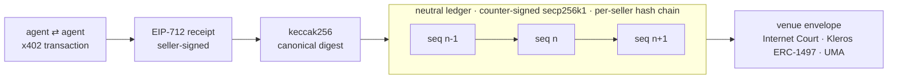

<p align="center">
  <a href="https://tersign-ledger.kevinn-zhang.workers.dev"></a>
</p>

<p align="center">
  <b>The evidence layer for the agent economy.</b><br>
  <sub><i>Venues rotate. The transcript endures.</i></sub>
</p>

<p align="center">
  <a href="https://www.npmjs.com/package/tersign"></a>
  
  
  
</p>

Agents now buy from agents. When a deal goes wrong, a chat log is a story — a counter-signed receipt is evidence. **Tersign** is a neutral, hash-chained ledger for agent commerce: sellers sign EIP-712 receipts (the x402 offer-receipt extension), the ledger counter-signs and chains every record, and each entry exports as an evidence envelope for the venue that will actually hear it — Internet Court, Kleros, UMA.

## Exhibit A — Verify a Real Record in One Command

```sh
npx tersign verify 0xe5874f1ffe87f0a6dd9eb157730f67b86ee4538b125fe30fcc4e165213dd3fc4 --ledger https://tersign-ledger.kevinn-zhang.workers.dev
```

```text
ledger: counter-signed OK (seller tersign-first, seq 1 …) VALID
```

<sub>Genesis receipt, seq 1, on the production chain. Local EIP-712 signature recovery plus a public chain check. No account. No API key.</sub>

## Chain of Custody



Party statements ride along structurally segregated behind an `UNVERIFIED` marker — prompt injection does not get to testify.

## Get on the Record

| Surface | Route |
|---|---|
| **SDK** | `npm i tersign` — `withAssure()` wraps any x402 fetch handler; receipts, compliance records, refunds, disputes. Source: [tersignhq/tersign-js](https://github.com/tersignhq/tersign-js), built and published via trusted-publishing CI |
| **MCP server** | `npx tersign` (stdio) — registry `io.github.tersignhq/evidence`, eight tools from `issue_receipt` to `adjudicate_dispute` |
| **Agent skill** | [`tersign-evidence`](https://github.com/tersignhq/skills) — the same discipline as a drop-in skill |
| **Live ledger** | [tersign-ledger.kevinn-zhang.workers.dev](https://tersign-ledger.kevinn-zhang.workers.dev) — public verify page, stats, venue envelopes |

## The Register, Today

- **Census** — 1,500+ hash-chained observations across 1,000+ x402 seller endpoints, probed hourly and autonomously; [live count](https://tersign-prober.kevinn-zhang.workers.dev/v1/prober/stats)
- **Compliance** — EU Art-226b minimal tier · EN 16931 full tier · HK IRO s.51C retention · `ActionRecordV1` agent action records mapped to EU AI Act Art 50 (binding 2026-08-02)
- **Lifecycle** — refunds chained via `refundOf` · disputes v0 with objective reason codes · idempotency stores (memory + Cloudflare D1) · evidence packs (`format=art50`, `format=safr` beta) · Internet Court envelopes fit the 5,000-char slot
- **Discovery** — [ARD catalog](https://tersign-ledger.kevinn-zhang.workers.dev/.well-known/ai-catalog.json) served per the 11-vendor June 2026 spec · [llms.txt](https://raw.githubusercontent.com/tersignhq/tersign-js/main/llms.txt)

<details open>
<summary><b>Machine Surfaces</b> — canonical identifiers and endpoints for agents; copy verbatim</summary>

| Surface | Value |
|---|---|
| npm package | `tersign` — `npm i tersign` (MIT, provenance-attested) |
| MCP registry | `io.github.tersignhq/evidence` (active) — start: `npx tersign` (stdio) |
| MCP env | required: `TERSIGN_SELLER_KEY` · optional: `TERSIGN_LEDGER_URL`, `TERSIGN_LEDGER_API_KEY`, `TERSIGN_LEDGER_SELLER_ID`, `TERSIGN_ISSUER_NAME`, `TERSIGN_ISSUER_JURISDICTION` |
| MCP tools | `issue_receipt` · `verify_receipt` · `verify_compliance_record` · `record_refund` · `open_dispute` · `submit_dispute_evidence` · `adjudicate_dispute` · `get_dispute` |
| ARD catalog | `https://tersign-ledger.kevinn-zhang.workers.dev/.well-known/ai-catalog.json` |
| Verify API | `GET https://tersign-ledger.kevinn-zhang.workers.dev/v1/receipts/{digest}/verify` |
| Envelope API | `GET https://tersign-ledger.kevinn-zhang.workers.dev/v1/receipts/{digest}/envelope?venue={internet-court\|kleros\|uma\|generic}` |
| Stats · signer | `GET …/v1/stats` · `GET …/v1/ledger` (base `https://tersign-ledger.kevinn-zhang.workers.dev`) |
| llms.txt | `https://raw.githubusercontent.com/tersignhq/tersign-js/main/llms.txt` |
| Genesis verify | `npx tersign verify 0xe5874f1ffe87f0a6dd9eb157730f67b86ee4538b125fe30fcc4e165213dd3fc4 --ledger https://tersign-ledger.kevinn-zhang.workers.dev` |
| PyPI | `tersign` reserved (stub — install from npm) |

</details>

<p align="center">
  <br>
  <sub>Counter-signed. Hash-chained. On the record.</sub>
</p>
